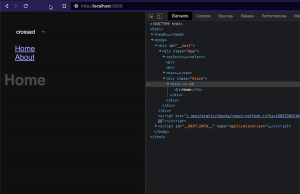

# NextJS Stack transitions

This repo is an example of [NextJS](https://nextjs.org/) route transitions via a Stack component
whose purpose is to render flexible "how" and "when" the playIn and playOut of each
page component is played.

The main goal is to have the same Stack logic existing
on [@cher-ami/router](https://github.com/cher-ami/router)
but on nextJS file system routing. Secondary, to be able to handle route transitions
without a DOM bound animation library like React Spring. This example is
animated with GSAP, but could be with any other libs.

<br>

<br>


## How it works

When the user update the browser history by clicking on "About" link, the Stack
will render two pages components:

```
App
 |_ Stack
      |_ Home          (prev page playOut)
      |_ About         (current page playIn)
```

When the transition is complete, prev page is unmount.

```
App
 |_ Stack
      |_ About
```

In order to do this, each page register for the parent Stack component a playIn and playOut
function + the DOM root element via `useImperativeHandle`. The Stack can thus be able to access
these properties.

```jsx
const Home = forwardRef((props, handleRef) => {
  const $root = useRef(null)
  useImperativeHandle(handleRef, () => ({
    playIn: () => gsap.timeline().fromTo($root.current, { autoAlpha: 0 }, { autoAlpha: 1 }),
    playOut: () => gsap.timeline().to($root.current, { autoAlpha: 0 }),
    $root: $root.current,
  }))
})
```

Otherwise, the root App component will manage the transitions function added to Stack component by props.
We can now control the scenario with previous and current page components \o/

```jsx
function App({ Component, pageProps }) {
  const custom = useCallback(
    ({ prev, current }) =>
      new Promise(async (resolve) => {
        // playOut prev page component
        if (prev) await prev.playOut?.()
        // when playOut is complete, playin new current page component
        await current.playIn?.()
        resolve()
      }),
    []
  )
  return (
    <div className={"App"}>
      <Stack Component={Component} customTransitions={custom} />
    </div>
  )
}
```

## Test it online

[nextjs-stack-transitions.vercel.app](https://nextjs-stack-transitions-dpbcjaqqi-willybrauner.vercel.app)

## Install the example

Clone the repos and move to the cloned repository:

```shell
git clone <this-repos> && cd nextjs-route-stack-transitions-example
```

Install dependencies:

```shell
npm i
# or
yarn
```

Run the nextJS dev-server:

```shell
npm run dev
```

## Credits

Willy Brauner
